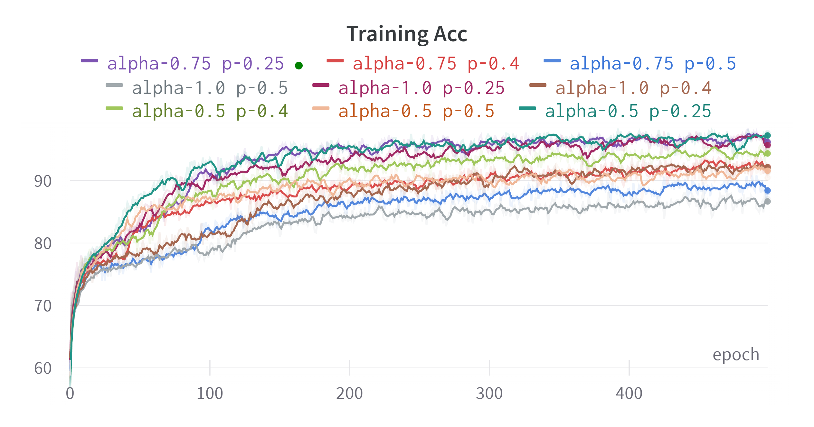

# 人工智慧醫學影像第二次作業

The report is generated by W & B platform, and is public open source 

Author : 311657007 統計碩一

Test set Accuracy: 87.22 % 

## Configuration

| Key          | Default Value |
|--------------|---------------|
| num_epochs   | 5000          |
| batch_size   | 256           |
| lr           | 0.01          |
| alpha        | 0.5           |
| p            | 0.5           |
| name         | alpha-0.5 p-0.5 |
| project      | EEG-Classification |

Note: alpha 為 ELU 參數
Note: p 為 Dropout rate

## Introduction

以下會簡介本工作會包含的主題

1. 資料
2. 模型
3. 激活函數

### Dataset

這次的資料是 EEG 的資料，用來做二元分類，資料大小為 (1080, 1, 2, 750) 為雙通道，特徵維度為 750 的資料

### Model

模型採用 [EEGNet](https://arxiv.org/pdf/1611.08024.pdf)，其架構包含三個主要模塊

#### Convolution

捲積運算可以看成是一個 2D 的矩陣運算，其主要參數包括

- in_channels: 輸入通道數目
- out_channels: 輸出通道數目
- kernel_size: 捲積核大小
- stride: 捲積運算步長
- padding: 補 0，通常為 int(kernel_size // 2)
- group: 分組捲積運算

Note: 一個捲積運算的參數數量會是 in_channels * out_channels * kernel_size / group

##### Normal Convolution

常規的捲積操作是對於每一個輸入通道，生成大小為捲積核的濾波器進行捲積操作，每次會得到一個捲積，這個過程會重複輸出通道次，最終會得到輸出通道個特徵圖

##### Depthwise Separable Convolution

不同於常規捲積操作，Depthwise Separable Convolution 會先把捲積分為兩個步驟 Depthwise + Pointwise

- DepthWise: 會對捲積進行分組操作 (MobileNet 方法為一個捲積核負責一個輸入通道)
   - 由於這個方法會損失組與組之間的交互信息，我們需要使用 PointWise 來組合組間訊息
- PointWise: 通常 PointWise 為 1 * 1 的捲積 (但在 EGGNet 為常規捲積操作)

這種方法可以大大減少參數使用量

### Architecture

- FirstConv

第一層的捲積用來提取信號的主要特徵

```python
self.firstconv = nn.Sequential(
    nn.Conv2d(1, 16, (1, 51), (1, 1), (0, 25), bias=False),
    nn.BatchNorm2d(16)
)
```

- DepthwiseConv

第二個的模塊來自於 MobileNet 的 Depthwise Convolution

```python
self.depthwiseConv = nn.Sequential(
    nn.Conv2d(16, 32, (2, 1), (1, 1), groups=16, bias=False),
    nn.BatchNorm2d(32),
    nn.ELU(alpha),
    nn.AvgPool2d((1, 4), (1, 4)),
    nn.Dropout(p),
)
```

- SeparableConv

第二個的模塊來自於 MobileNet 的 Separable Convolution

```python
self.separableConv = nn.Sequential(
    nn.Conv2d(32, 32, (1, 15), (1, 1), (0, 7), bias=False),
    nn.BatchNorm2d(32),
    nn.ELU(alpha),
    nn.AvgPool2d((1, 8), (1, 8)),
    nn.Dropout(p),
)
```

- Classify

前面三大模塊主要為提取信號的特徵，後面的 classify 為分類器，用來理解特徵提取的結果與做出判斷

```python
self.classify = nn.Sequential(
    nn.Linear(in_features=736, out_features=2)
)
```

- Initialize Weight

我們使用  xavier 參數初始化

```python
def _init_weights(self):
    for m in self.modules():
        if isinstance(m, nn.Conv2d):
            nn.init.xavier_uniform_(m.weight, gain=1.0)
        elif isinstance(m, nn.BatchNorm2d):
            nn.init.constant_(m.weight, 1)
            nn.init.constant_(m.bias, 0)
        elif isinstance(m, nn.Linear):
            nn.init.xavier_uniform_(m.weight, gain=1.0)
            nn.init.constant_(m.bias, 0)
```

- Forward propagation

前向傳播的方法為 提取特徵 --> Flatten --> 分類

```python
def forward(self, x):
    x = self.firstconv(x)
    x = self.depthwiseConv(x)
    x = self.separableConv(x)
    x = x.view(x.size(0), -1)
    x = self.classify(x)    
    return x
```

### Activation

EGGNet 使用的激活函數是 ELU，我們接下來比較 ELU 與其他激活函數的差別


1. ELU（Exponential Linear Unit）：對於負數輸入，它使用一個指數函數來保證負數的輸出有一定的負值，並比ReLU在處理負值時具有更平滑的性質，有助於提高模型的準確性。但計算複雜度較高，且在某些情況下容易發生梯度消失的問題。
2. ReLU（Rectified Linear Unit）：對於正數輸入，輸出與輸入相等，而對於負數輸入，輸出則為0。由於其簡單有效，ReLU是目前最常用的激活函數之一。但ReLU在輸入為負時會出現"dead neurons"問題，即神經元將不再更新其權重。
3. LeakyReLU：在負數輸入時，輸出不再是0，而是一個較小的負數，這樣可以解決ReLU出現的dead neurons問題。但如果負數輸入較多時，模型訓練的速度會變慢。
4. SReLU（SmoothReLU）：是ReLU的一個變種，它在輸入接近0時，輸出比ReLU更加平滑，並且在輸入很大或很小時，輸出也有一定的負值。這樣可以在保留ReLU優點的同時，進一步降低dead neurons問題的發生率。

## Experimental Results

本章節將會調查不同的 alpha (ELU 臨界值) 和 p (Dropout 概率) 對於模型性能的影響，我們將會用 Grid Seaerch 執行以下幾 9 種結果，並討論哪種對於該筆資料最合適

1. (alpha, p) = (0.5, 0.25)
1. (alpha, p) = (0.5, 0.4)
1. (alpha, p) = (0.5, 0.5)
1. (alpha, p) = (0.75, 0.25)
1. (alpha, p) = (0.75, 0.4)
1. (alpha, p) = (0.75, 0.5)
1. (alpha, p) = (1.0, 0.25)
1. (alpha, p) = (1.0, 0.4)
1. (alpha, p) = (1.0, 0.5)

最終我們講選用我們覺得最合適的方案進行最後的訓練

### Albation Study

進行實驗之前，我們固定超參數如下

| Key          | Default Value |
|--------------|---------------|
| num_epochs   | 500           |
| batch_size   | 256           |
| lr           | 0.01          |
| weight decay | 0.001         |
| optimizer    | Adam          |
| Loss         | CrossEntropy  |

以下我們畫出九種實驗結果的 Training Acc, Testing Acc, Training Loss

<div align="center">
    
    
    
</div>

<div align="center">
    
    
    
</div>

可以看出 p 越小越容易 overfitting，且在 alpha 的選擇上 0.5, 0.75 的表現比 1 好很多

可以從 coordinate 圖表中看出 (alpha, p) = (0.5, 0.4) 是最好的實驗組合，從最後兩張圖表來看這個實驗組合的參數也是最佳的選擇，但是我們發現 (alpha, p) = (0.5, 0.5) 是最不容易 over-fitting 的組合，因此我們在後續使用此參數組合訓練 5000 epochs 來達到該參數下模型的最佳效能

### Final Result 

最後我們使用 (alpha, p) = (0.5, 0.5) 的配置訓練 5000 epochs，並在 3535 達到 baseline


## Dissicusion

在本次實驗中，我們期望使用 Single Model 去達到 Testing Set 的 baseline，且在這次的 single model 中我們使用了較為簡單的參數設置，無 scheduler, pretrained, augmentations 等等

### Found

我們在實驗過程中發現以下幾個現象

1. 大於一層的 classify 很容易 over-fitting
2. weight-decay 會嚴重影響 training acc，但是對於 testing acc 影響較小
3. alpha 嚴重影響 testing acc
4. p 嚴重影響 training acc

### Future Work

1. KFold
2. Ensemble
3. Learning Rate Scheduler
4. Preprocessing